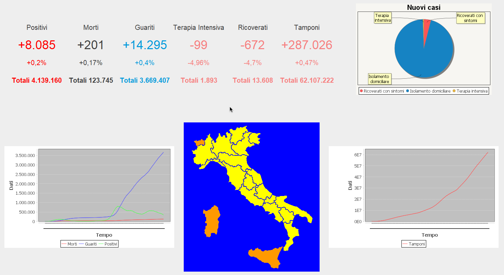

# Covid-19_Data
<h2>Authors</h2>
<ul>
  <li>Alessio Z.</li>
  <li>Davide I.</li>
</ul>
<h2>The Project</h2>

Covid-19_Data is a simple project to visualize Covid-19 updated datas everyday

<h2>Prerequisites</h2>

>To use the project you just need to install latest <a href="https://www.oracle.com/java/technologies/javase/jdk15-archive-downloads.html">JRE</a>

