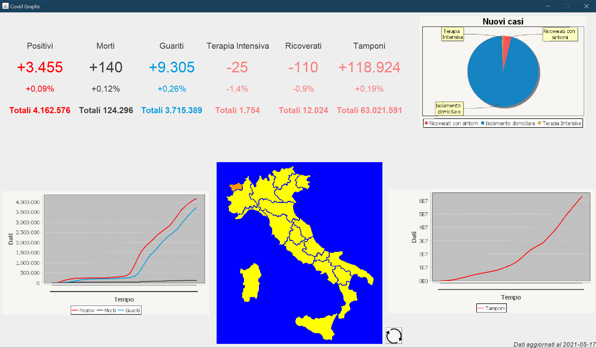

# Covid-19_Data
<h2>Authors</h2>
<ul>
  <li>Alessio Z.</li>
  <li>Davide I.</li>
</ul>
<h2>The Project</h2>
<p>Covid-19_Data is a simple project to visualize Covid-19 updated datas everyday</p>

<h2>Prerequisites</h2>
<ul>
  <li>A Full HD monitor</li>
  <li>The latest version of the <a href="https://www.oracle.com/java/technologies/javase/jdk15-archive-downloads.html" target="_blank">JRE</a></li>
</ul>
<h1>WARNING</h1>
<p> The .jar file located in 

```
|---Covid-19_Data/
|   |---dist/
|       |---Covid-19_Data.jar
```
  
may not refresh daily data, we're working on that!</p>
